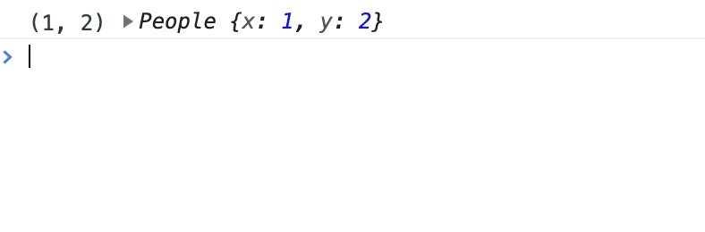
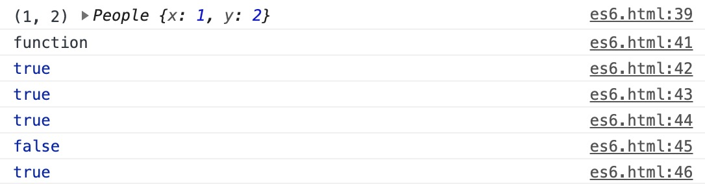

<!--
 * @Author: your name
 * @Date: 2021-02-16 16:13:12
 * @LastEditTime: 2021-02-16 17:10:23
 * @LastEditors: Please set LastEditors
 * @Description: In User Settings 
 * @FilePath: /fe-interview/es6/es6.md
-->
## es6新特性

ES6的特性比较多，在 ES5 发布近 6 年（2009-11 至 2015-6）之后才将其标准化。两个发布版本之间时间跨度很大，所以ES6中的特性比较多。
在这里列举几个常用的：

- 类
- 模块化
- 箭头函数
- 函数参数默认值
- 模板字符串
- 解构赋值
- 延展操作符(展开操作符)
- 对象属性简写
- Promise
- Let与Const

## 1、类（class）

JavaScript 语言中，生成实例对象的传统方法是通过构造函数。下面是一个例子。

```js
function People(x, y) {
  this.x = x;
  this.y = y;
}
People.prototype.toString = function() {
  return '(' + this.x + ', ' + this.y + ')';
}
var a = new People(1, 2)
console.log(a.toString(), a)
```


对熟悉Java，object-c，c#等纯面向对象语言的开发者来说，都会对class有一种特殊的情怀。ES6 引入了class（类），让JavaScript的面向对象编程变得更加简单和易于理解。
```js
class People {
  constructor(x, y) {
    this.x = x
    this.y = y
  }
  toString() {
    return '(' + this.x + ', ' + this.y + ')';
  }
}
var a = new People(1, 2)
console.log(a.toString(), a)
// ES6 的类，完全可以看作构造函数的另一种写法。
console.log(typeof People)
console.log(People === People.prototype.constructor)
console.log(a.hasOwnProperty('x')) // true
console.log(a.hasOwnProperty('y')) // true
console.log(a.hasOwnProperty('toString')) // false
console.log(a.__proto__.hasOwnProperty('toString')) // true

```


